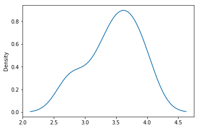
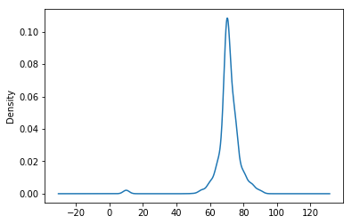
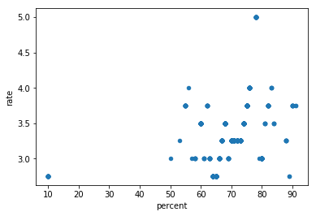
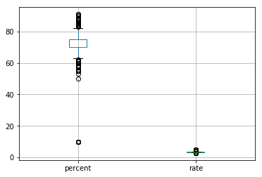
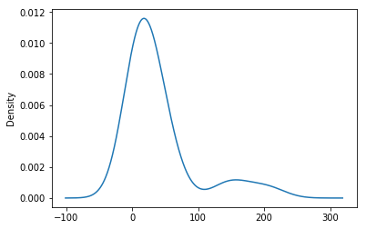
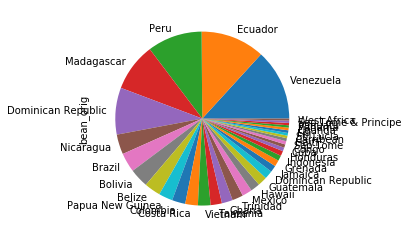
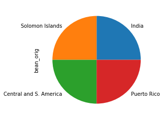
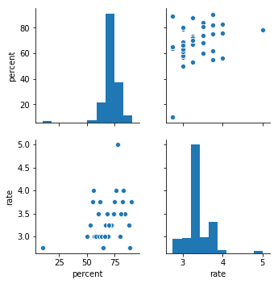

```python
import pandas as pd
import numpy as np
import matplotlib.pyplot as plt
import re

from sklearn import preprocessing
from seaborn import pairplot
```


```python
best_bar = pd.read_csv('flavors_of_cacao.csv',
                       sep=',', header=0, names=['company', 'bar_name','ref', 'rew_date', 'percent', 'company_loc', 'rate', 'bean_dtype', 'bean_orig'])
```


```python
bar = best_bar[['company_loc', 'rate', 'percent', 'bean_orig']]

# сортируем, убираем лишнее (группы по странам, где мало информации, неправильное нарзвание этих стран)
groupedAndSorted = bar.groupby('bean_orig')
bar = groupedAndSorted.filter(lambda x: len(x) > 3)
bar = bar[bar.bean_orig != '\xa0']
# bar.head()

print(bar)
```

          company_loc  rate percent           bean_orig
    0          France  3.75     63%            Sao Tome
    4          France  3.50     70%                Peru
    5          France  2.75     70%           Venezuela
    6          France  3.50     70%                Cuba
    7          France  3.50     70%           Venezuela
    8          France  3.75     70%           Venezuela
    9          France  4.00     70%                Peru
    10         France  2.75     70%              Panama
    11         France  3.00     70%          Madagascar
    12         France  3.25     70%              Brazil
    13         France  3.75     70%             Ecuador
    14         France  2.75     70%            Colombia
    16         France  3.25     70%    Papua New Guinea
    17         France  4.00     70%           Venezuela
    18         France  3.25     70%                Peru
    19         France  3.50     70%                Peru
    20         France  4.00     63%                Peru
    21         France  3.50     70%             Bolivia
    22         France  3.75     63%                Peru
    23         U.S.A.  3.75     70%                Peru
    24         U.S.A.  3.75     70%                Peru
    25           Fiji  2.75     60%                Fiji
    26           Fiji  3.25     80%                Fiji
    27           Fiji  3.50     88%                Fiji
    28           Fiji  3.50     72%                Fiji
    29        Ecuador  2.75     55%             Ecuador
    30        Ecuador  3.00     70%             Ecuador
    31         Mexico  3.00     70%              Mexico
    32    Switzerland  3.75     75%           Indonesia
    33    Switzerland  2.75     75%          Madagascar
    ...           ...   ...     ...                 ...
    1760       U.S.A.  2.50     70%  Dominican Republic
    1761       U.S.A.  3.00     70%    Papua New Guinea
    1762       U.S.A.  3.25     70%   Domincan Republic
    1763       U.S.A.  3.25     70%          Madagascar
    1764       U.S.A.  3.25     70%                Peru
    1765       U.S.A.  3.50     70%              Belize
    1767      Austria  3.50     70%          Madagascar
    1768      Austria  2.75     70%             Ecuador
    1769      Austria  2.75     85%            Trinidad
    1770      Austria  3.00     85%            Tanzania
    1771      Austria  3.50     70%            Tanzania
    1772      Austria  3.50     78%            Trinidad
    1773    Australia  3.75     78%     Solomon Islands
    1775    Australia  3.50     68%             Bolivia
    1776    Australia  3.50     66%    Papua New Guinea
    1777    Australia  3.75     72%             Bolivia
    1779      Austria  3.50     72%              Panama
    1781      Austria  3.00     70%                Peru
    1782      Austria  3.50     70%                Peru
    1783      Austria  3.75     62%  Dominican Republic
    1784      Austria  3.00     75%             Ecuador
    1785      Austria  3.00     75%    Papua New Guinea
    1786      Austria  3.25     90%             Bolivia
    1787      Austria  3.75     70%  Dominican Republic
    1788      Austria  3.25     68%               Congo
    1790      Austria  3.75     70%                Peru
    1791      Austria  3.00     65%               Congo
    1792      Austria  3.50     65%               India
    1793      Austria  3.25     62%               India
    1794      Austria  3.00     65%              Brazil
    
    [1646 rows x 4 columns]
    


```python
bar.iloc[:20].rate.plot.kde()
```


    <matplotlib.axes._subplots.AxesSubplot at 0x27c70972710>





```python
berPercent = bar.percent.apply(lambda x: float(x[:2])) 
berPercent.plot.kde()
type(berPercent)
```


    pandas.core.series.Series





```python
berFrame = pd.Series(index = berPercent, data = bar.rate).to_frame()
berFrame.reset_index(inplace=True)
berFrame.columns = ['percent','rate']
berFrame.plot(kind='scatter', x='percent', y='rate')

```


    <matplotlib.axes._subplots.AxesSubplot at 0x27c70481a90>





```python
berFrame.boxplot()
```


    <matplotlib.axes._subplots.AxesSubplot at 0x27c704f3390>





```python
berBeanOrigUnique = bar.bean_orig.value_counts()
maskValue = bar.bean_orig.unique()

berBeanOrigUnique = berBeanOrigUnique.dropna(how = 'any')
berBeanOrigUnique.plot(kind='kde')
```


    <matplotlib.axes._subplots.AxesSubplot at 0x27c70558438>





```python
valueCounts = bar.bean_orig.value_counts()

berBeanOrigUnique = valueCounts[valueCounts > 5]
berBeanOrigUnique.plot.pie()
plt.show()

asasas = valueCounts[valueCounts < 5]
asasas.plot.pie()
plt.show()
```








```python
pairplot(berFrame)
plt.show()
```

    D:\python\Anaconda3\lib\site-packages\numpy\lib\histograms.py:824: RuntimeWarning: invalid value encountered in greater_equal
      keep = (tmp_a >= first_edge)
    D:\python\Anaconda3\lib\site-packages\numpy\lib\histograms.py:825: RuntimeWarning: invalid value encountered in less_equal
      keep &= (tmp_a <= last_edge)
    





```python
# группируем, сортируем
groupedAndSorted = bar.groupby('bean_orig')['rate'].mean().sort_values(ascending=False)
groupedAndSorted.head(10)

# for key, item in groupedAndSorted:
#     group = groupedAndSorted.get_group(key)
#     print(groupedAndSorted.get_group(key), '\n\n')

```


    bean_orig
    Solomon Islands           3.437500
    Haiti                     3.388889
    Honduras                  3.350000
    Congo                     3.325000
    Guatemala                 3.321429
    Vietnam                   3.315789
    Papua New Guinea          3.291667
    Brazil                    3.284483
    Madagascar                3.265517
    Central and S. America    3.250000
    Name: rate, dtype: float64


```python

```
